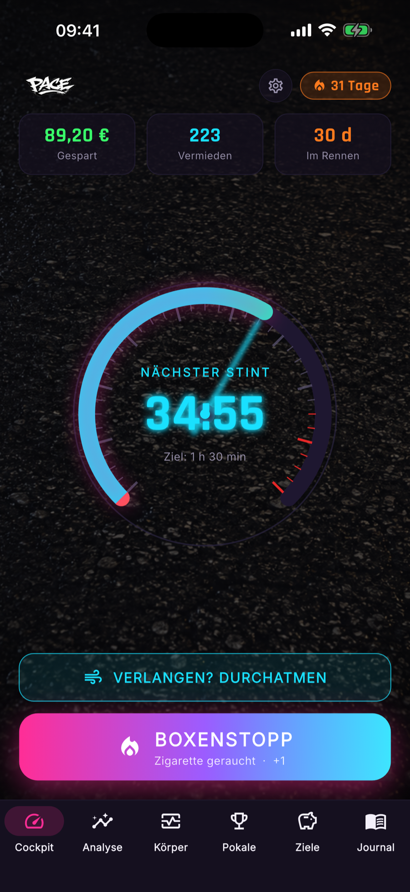
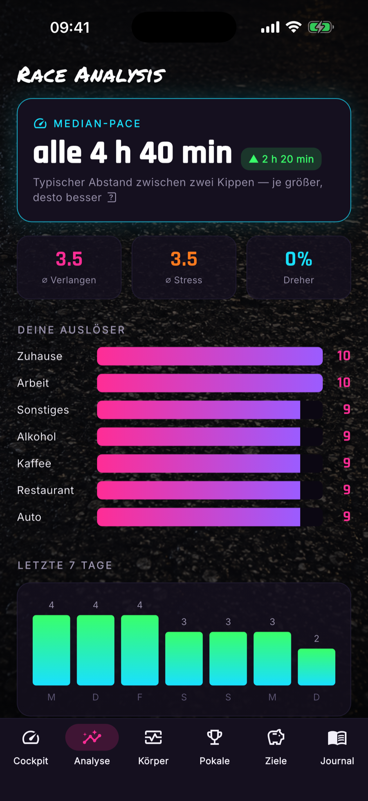
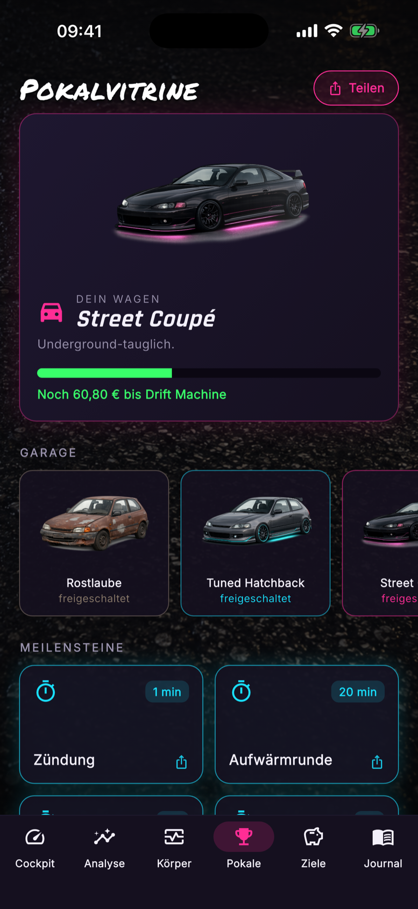
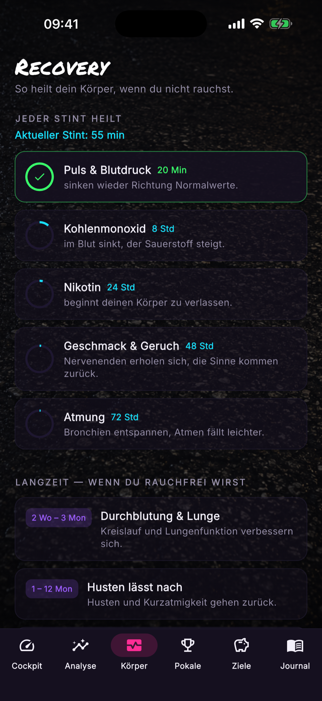
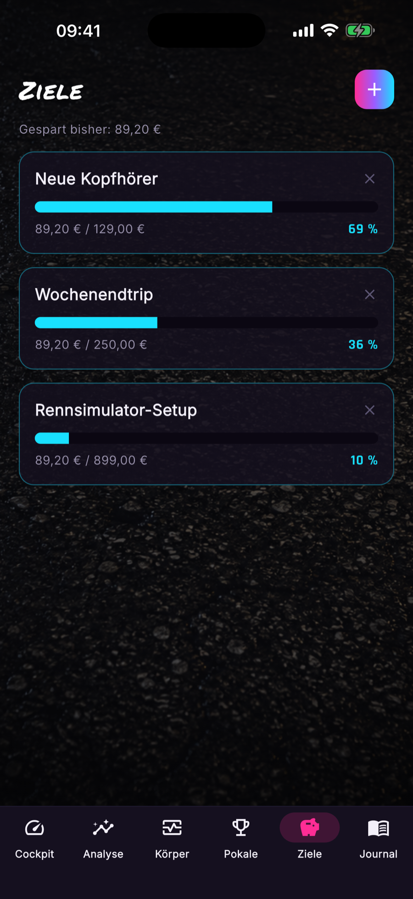
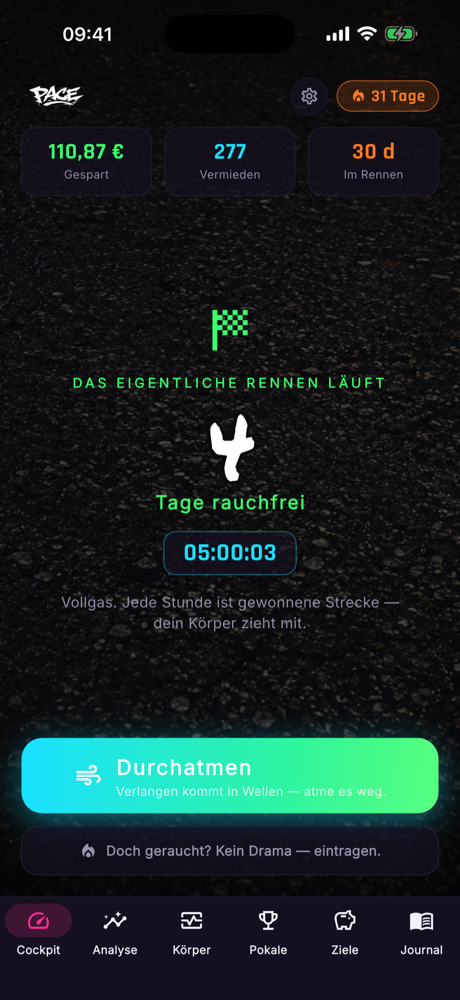
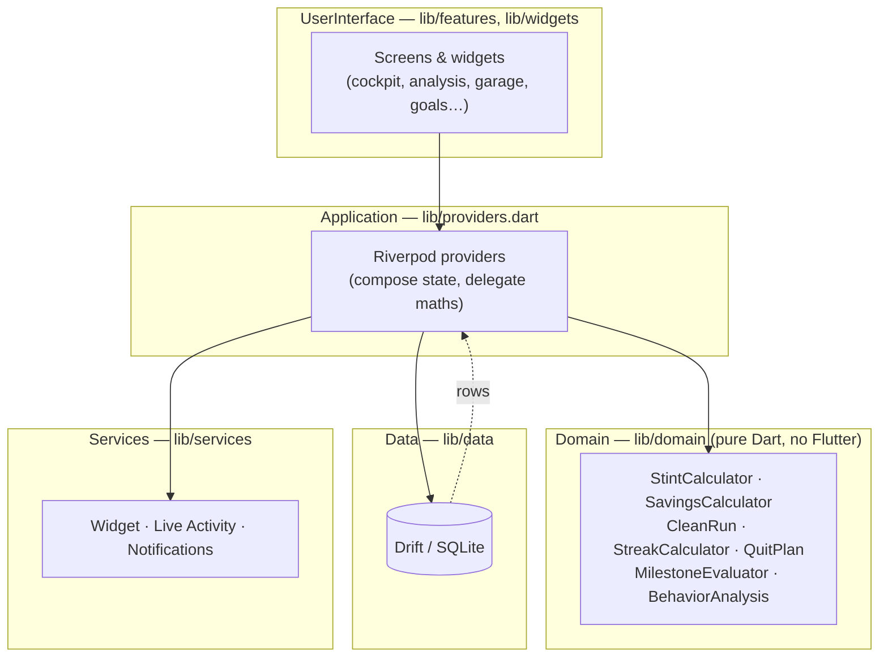

<div align="center">


# Pace

**Quitting smoking, reframed as a street race.**

A Y2K / *Need-for-Speed*-flavoured iOS app that turns cutting down and quitting
smoking into a game of stretching your pace, banking savings, and unlocking cars.

[](https://github.com/marcelgast/paceapp/actions/workflows/ci.yml)
[](https://flutter.dev)
[](#)
[](LICENSE)

</div>

---

> **Project status.** Pace shipped on the App Store and has since been retired.
> This repository is kept public as an engineering portfolio piece: a complete,
> real, single-developer Flutter app — domain logic, local persistence, iOS
> Live Activities and home-screen widgets, localization and all.

## The idea

Most quit-smoking apps nag. Pace races.

Every cigarette is a **box stop** (Boxenstopp). The time *between* cigarettes is
a **stint**, and the whole game is stretching that stint a little longer each
week. Survive past your target and you're in **overtime** — every full target
length you hold banks one cigarette you *didn't* smoke, priced at your real pack
cost. Those savings buy **cars** in your garage, from a rusty starter to a
hypercar.

When you're ready, you set a **quit date and time**. Pace counts down to it, then
flips into a smoke-free companion: a live day-counter, the money still stacking
up, and your streak on the lock screen via a **Live Activity** and a home-screen
**widget**.

No shame, no lectures — just a dashboard that makes the numbers feel like a win.

## Screenshots

| Cockpit | Analysis | Garage |
|:---:|:---:|:---:|
|  |  |  |
| The live stint gauge, overtime and savings | Median pace, triggers, weekly pattern | Cars unlocked by money saved |

| Recovery | Goals | Smoke-free |
|:---:|:---:|:---:|
|  |  |  |
| Body-recovery timeline since your last one | Savings goals to spend the money on | The real race: days smoke-free |

## Features

- **Stint mechanic** — a live cockpit gauge counts up in the measuring phase,
  then counts down against a weekly target and rolls into overtime.
- **Weekly stretch proposals** — Pace measures your real median pace and proposes
  a gentle target increase (default +10 %/week), which you accept or decline.
- **Cent-accurate savings** — cigarettes avoided and money saved, priced by the
  pack cost *in effect at the time* (price changes never re-price the past).
- **Quit-date companion** — an exact quit moment, a countdown, then a smoke-free
  run with a live day counter that keeps the savings climbing.
- **iOS Live Activity & home-screen widget** — the stint (or the smoke-free
  timer) on the lock screen and Dynamic Island, self-updating, with a box-stop
  button.
- **Behaviour analysis** — median pace with trend, craving/stress averages,
  trigger situations, and a 7-day pattern (the "Race Engineer").
- **Gamification** — a garage of cars, time/money/avoided milestones, streaks,
  and shareable race cards.
- **Recovery timeline** — how the body heals since the last cigarette.
- **Neon skins** — ten runtime-swappable accent palettes.
- **Fully localized** — German and English.

## Architecture

Pace is a layered Flutter app with a **pure, framework-free domain core**. All
the arithmetic that has to be correct — stints, savings, streaks, milestones,
recovery — lives in `lib/domain/` with zero Flutter imports, so it is trivially
unit-testable and deterministic (same inputs → same output).



**Layout**

```
lib/
├── domain/       Pure calculators & value objects (the tested core)
├── data/         Drift database, tables, id generation
├── providers.dart  Riverpod graph — gathers inputs, delegates to domain
├── features/     One folder per screen (UI only)
├── services/     iOS widget, Live Activity, notifications bridges
├── theme/        Colours, skins, racetrack background
├── widgets/      Shared UI atoms
└── l10n/         ARB translations (de/en) + generated localizations
```

**Principles**

- **Domain purity** — `lib/domain/` imports nothing from Flutter. Money is
  integer cents, computed with explicit rounding — never floats in a money path.
- **Thin providers** — `providers.dart` only assembles inputs and delegates. The
  savings/stint maths lives in `SavingsCalculator`, not inside a provider.
- **State** — [Riverpod](https://riverpod.dev) throughout, deriving from a few
  Drift stream providers.
- **iOS native** — Live Activities and the WidgetKit extension talk to Dart
  through an App Group; the Swift widget renders a self-updating timer so Dart
  only pushes on meaningful changes, not every second.

## Tech stack

Flutter · Dart · [Riverpod](https://riverpod.dev) · [Drift](https://drift.simonbinder.eu)
(SQLite) · [live_activities](https://pub.dev/packages/live_activities) ·
[home_widget](https://pub.dev/packages/home_widget) ·
[flutter_local_notifications](https://pub.dev/packages/flutter_local_notifications) ·
Swift / WidgetKit · gen_l10n.

## Getting started

Requires the [Flutter SDK](https://docs.flutter.dev/get-started/install) (3.41+)
and, for iOS, Xcode.

```bash
git clone https://github.com/marcelgast/paceapp.git
cd paceapp
flutter pub get
flutter run
```

The Live Activity and home-screen widget are iOS-only; the rest of the app runs
anywhere Flutter does.

To launch with a realistic, pre-populated dataset (used for the screenshots
above):

```bash
flutter run --dart-define=SEED_DEMO=true
```

## Testing

The domain layer is covered by a fast, pure unit-test suite:

```bash
flutter test
```

```bash
flutter analyze        # static analysis (flutter_lints)
dart format lib test   # formatting
```

CI runs formatting, analysis and tests on every push and pull request.

## License

Source code is released under the [MIT License](LICENSE). The **Pace** name, the
app logo/wordmark and the car/branding artwork under `assets/` are not covered by
that grant — please swap in your own branding if you build on this code.
